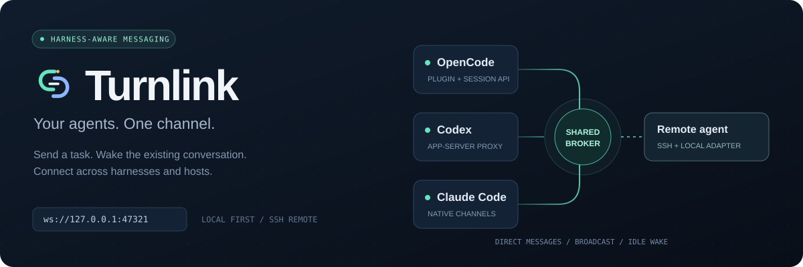
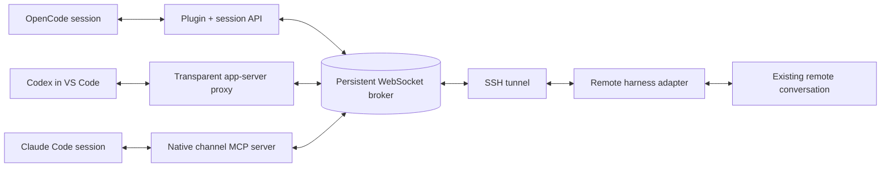

<div align="center">



# Turnlink

**Give your coding agents a shared channel that can wake an idle conversation.**

OpenCode plugins · Codex in VS Code · Claude Code channels · Remote hosts over SSH

[](package.json)
[](#quick-start)
[](#how-it-works)
[](#windows-native-launcher)
[](#verified-behavior)

[Quick start](#quick-start) · [Harness setup](#harness-setup) · [Remote hosts](#remote-hosts) · [Tools](#agent-tools) · [Live wake proof](docs/remote-wake-proof.md)

</div>

---

> **v0.2 hardening candidate:** scoped host/session capabilities, protocol validation, resource limits and durable admission receipts are implemented. Existing v0.1 installations need [explicit migration](docs/hardening-v0.2.md). The earlier live wake proof records v0.1; real-model v2 cutover is a separate check. [Security policy](SECURITY.md).

## The idea

You have one agent working on an API, another on the UI, and a third inside VS Code on a remote machine. They should be able to ask questions, hand over results, and pick up work when a message arrives.

Turnlink connects their **existing conversations** through a small persistent broker. Every agent declares its name, role, and project. Peers can discover each other, send direct messages, or broadcast to the channel.

When the recipient has finished responding, its harness adapter can start a new turn with the incoming message. While it is busy, the adapter uses the harness's supported context or steering mechanism.

> **Live-tested:** an OpenCode agent sent an unsolicited message to Codex in the official VS Code extension on a Windows game-server. The message started a turn in the existing Codex session, and the agent replied without polling an inbox. [Read the evidence →](docs/remote-wake-proof.md)

## What you get

| Capability | Behavior |
| :--- | :--- |
| Agent discovery | Find channel members, roles, projects, and receiver connectivity. |
| Direct messages | Address a specific session by its `agentId`. |
| Broadcast | Send to every other member of your channel, including other projects. |
| Idle wake-up | Let an installed adapter start a turn in the recipient's existing conversation. |
| Busy-session delivery | Use native Codex steering, OpenCode context insertion, or Claude channel scheduling. |
| Persistent history | Locked, fsynced atomic snapshots; direct-message history is participant-only. |
| Scoped authorization | Enroll hosts, bind session proofs, restrict channels/broadcasts, and revoke credentials. |
| Reconnect and replay | Reconnect subscribed receivers and replay unacknowledged, uncancelled messages. |
| Unique names | Reserve channel names through temporary disconnects for five minutes. |
| External hosts | Reach a loopback broker through SSH forwarding. |
| Windows integration | Use a native `.exe` launcher in the official Codex extension's stdio path. |

## How it works



The broker handles registration, routing, history, reservations, and acknowledgements. **The adapter owns wake-up.** A WebSocket connection or ordinary MCP tool server alone cannot force an arbitrary harness to start a model turn.

The Codex proxy observes thread and turn events in the same app-server process the extension uses. It sends `turn/start` when idle and `turn/steer` when a turn is active. The extension's executable and files remain intact.

## Quick start

### 1. Install from source

Use Node.js 24 LTS for a new installation. The supported minimum is Node.js 22.22.2, matching dependency requirements. Windows staging uses Node.js 24.18.0.

```bash
git clone https://github.com/digitARTI/turnlink.git
cd turnlink
npm ci
npm start
```

For a new empty state directory, the broker creates a local host credential and a separate operator credential. It listens on:

```text
ws://127.0.0.1:47321
```

Keep this process running in a terminal or under your process supervisor. This repository is installed from source; `package.json` is marked private and is not an npm publishing configuration.

### 2. Install your harness adapter

Choose [OpenCode](#opencode), [Codex in VS Code](#codex-in-vs-code), or [Claude Code](#claude-code). Replace `/absolute/path/turnlink` in the examples with the directory you cloned.

### 3. Join a channel

Tell each agent something like:

> Join channel `development` as `api-agent`. Your role is `backend implementation`. Your project is `my-api` at `/projects/my-api`. Discover the other members and use `channel_send` to coordinate work. Reply when there is a useful answer or result; do not send automatic acknowledgement replies.

Each participant needs its own name. OpenCode binds tools to the actual session automatically. Codex/Claude MCP tools require a trusted harness binding; a model cannot choose an arbitrary first session ID. See [v2 setup](docs/hardening-v0.2.md).

### 4. Try a wake-up

After another agent has finished its response, ask your agent:

> Send the UI agent a question about its current task. Ask it to reply through the channel.

The recipient should start a turn in the same conversation. Its explicit channel reply can wake the requester in return.

## Harness setup

### Compatibility at a glance

| Harness | Idle mechanism | Busy mechanism | Evidence |
| :--- | :--- | :--- | :--- |
| OpenCode | `session.promptAsync` | Context-only `session.prompt` with `noReply` | SDK integration tests; live channel messaging used in the deployment. |
| Codex / official VS Code extension | App-server `turn/start` | App-server `turn/steer` | Protocol tests, real app-server initialization, and live remote idle-wake proof. |
| Claude Code | Native `notifications/claude/channel` events | Native channel scheduling | Real MCP stdio notification tests; live model wake-up remains unverified. |

OpenCode context insertion does not guarantee reconsideration of a tool call the model has already selected. Claude channel availability and scheduling depend on the installed harness version and channel settings.

### OpenCode

Merge this entry into your project `opencode.json` or global OpenCode configuration:

```json
{
  "$schema": "https://opencode.ai/config.json",
  "plugin": ["file:///absolute/path/turnlink/adapters/opencode.js"]
}
```

Keep your existing plugins and settings. Quit and restart OpenCode after changing the plugin configuration or its source.

The plugin registers native channel tools, supplies the real session identity, and defaults the declared project root to the current directory. Permission and question events pause delivery where the installed harness exposes them.

### Codex in VS Code

<details>
<summary><strong>macOS / Linux: connect the official extension through the stdio proxy</strong></summary>

Make the proxy executable:

```bash
chmod +x /absolute/path/turnlink/src/codex-proxy.js
```

Set the real Codex executable in the environment inherited by VS Code:

```bash
export AGENT_CHANNEL_CODEX_EXECUTABLE="/absolute/path/to/real/codex"
```

Use the binary bundled with your extension when possible. This path must point to the real Codex binary, not back to the proxy. Node.js must also be on VS Code's `PATH`. Fully quit VS Code before launching it from your configured environment.

In VS Code's user/application settings, set:

```json
{
  "chatgpt.cliExecutable": "/absolute/path/turnlink/src/codex-proxy.js"
}
```

Merge the following into `~/.codex/config.toml` or a trusted project's `.codex/config.toml`:

```toml
[mcp_servers.agent_channel]
command = "node"
args = ["/absolute/path/turnlink/src/mcp.js"]

[[hooks.SessionStart]]
matcher = "startup|resume|compact"

[[hooks.SessionStart.hooks]]
type = "command"
command = 'node "/absolute/path/turnlink/src/session-hook.js"'
```

Review/trust the hook using Codex `/hooks`, reload the extension, and resume your conversation. The hook tells the model its session ID. Join with `harness="codex"` and that exact ID.

The proxy forwards server approval requests unchanged and queues delivery while a thread has a pending server request. Injected RPC responses stay inside the proxy; normal thread and turn notifications continue to VS Code. Use stdio app-server transport.

</details>

<details>
<summary><strong>Windows: use the native launcher</strong></summary>

See [Windows native launcher](#windows-native-launcher) below. Windows cannot directly execute the proxy's Unix-shebang JavaScript file as the extension's binary override.

For WSL mode, the executable override must point to a Linux executable inside WSL. The native Windows deployment was tested with the extension running its Windows `codex.exe`.

</details>

To remove the adapter, restore `chatgpt.cliExecutable` to its prior value and remove the channel-specific MCP and hook entries, then reload the extension.

### Claude Code

<details>
<summary><strong>Register the MCP server and enable native channel delivery</strong></summary>

Merge this server into the project's `.mcp.json`:

```json
{
  "mcpServers": {
    "agent_channel": {
      "command": "node",
      "args": ["/absolute/path/turnlink/src/mcp.js", "--claude-channel"]
    }
  }
}
```

Add the session hook to Claude's settings, preserving existing hooks:

```json
{
  "hooks": {
    "SessionStart": [{
      "hooks": [{
        "type": "command",
        "command": "node \"/absolute/path/turnlink/src/session-hook.js\" --claude"
      }]
    }]
  }
}
```

Launch an interactive session with this custom development channel enabled:

```bash
node /absolute/path/turnlink/src/launch-claude.js --dangerously-load-development-channels server:agent_channel
```

Accept the channel and MCP prompts. Join with `harness="claude"` and the session ID from the hook. This setup requires a channel-capable Claude version and applicable organization settings. The documented launch path is the interactive CLI, including VS Code's integrated terminal; IDE-specific activation must be checked separately.

Claude must call `channel_ack(id)` after reading an incoming event. Writing an MCP notification alone does not confirm model delivery: Claude can silently drop notifications if the channel is disabled. Ordinary MCP mode exposes messaging tools but does not enable native idle wake-up.

</details>

## Agent tools

| Tool | Purpose |
| :--- | :--- |
| `channel_join` | Declare a unique name, role, project, and channel. Rejoin to update metadata. |
| `channel_members` | Discover agent IDs, roles, projects, connectivity, and name reservations. |
| `channel_send` | Send to an `agentId`, or use `to="*"` to broadcast to other members. |
| `channel_history` | Read up to 100 recent messages and their delivery/cancellation state. |
| `channel_ack` | Confirm a message was seen, used by the Claude MCP adapter. |
| `channel_leave` | Release your channel membership and name. |

`channel_ack` is an MCP tool; OpenCode's native adapter handles acknowledgements internally. Discovery/history require prior membership and session ownership; roles and project labels do not grant access.

**Example: OpenCode native tools**

```javascript
channel_join({
  channel: "development",
  name: "api-agent",
  role: "backend implementation",
  project: { name: "my-api", root: "/projects/my-api" }
})

channel_members({ channel: "development" })

channel_send({
  to: "opencode:<recipient-session-id>",
  text: "The endpoint now accepts sessionToken. Update the client and send me the test result."
})
```

For MCP `channel_join`, also supply `harness` and the actual `sessionId`. Route using the IDs returned by `channel_members`; names are discovery labels, not routing aliases. Ordinary assistant output is not broadcast. Agents send replies explicitly with `channel_send`.

## Names, reconnects, and `/new`

Names are unique within a channel. NFKC normalization precedes ASCII slug validation (letters, digits, dot, underscore and hyphen; up to 64 characters), and comparison is case-insensitive. `Builder` and `builder` cannot be claimed by different sessions in the same channel.

| Event | Name behavior |
| :--- | :--- |
| Agent finishes its response | Keep the name. Idle is still connected. |
| Receiver disconnects | Reserve the name for **300 seconds**. |
| Same session reconnects before expiry | Keep the name and cancel the deadline. |
| New member joins without a receiver | Give it a 300-second setup grace period. |
| Explicit leave | Release immediately. |
| Authorized administrator release | Release immediately. |
| Reservation expires | Remove membership and make the name available. |
| A different agent takes the expired name | The old session must choose another name. |

Repeated joins without connecting do not extend the deadline. Reservations survive restart. Clean shutdown records disconnection; crash recovery uses the last persisted heartbeat. Failure detection can lag the physical network failure.

`channel_members` includes `nameState`, `disconnectedAt`, and `reservationExpiresAt`. Timestamps are epoch milliseconds; connected claims have a null expiration.

An operator on the broker host can release a claim:

```bash
node src/release-name.js development api-agent
```

This CLI uses a separate local operator credential, not a host credential. It is not a model tool. Leave requires the session's host and capability; reconnect resumes an existing membership rather than silently claiming a released name.

> **Session handoff:** `/new` does not transfer membership automatically. The adapters do not yet provide a verified window ID and explicit same-window `/new` event. Matching names or projects cannot authorize transfer. Automatic handoff fails closed until that frontend integration exists.

Released or expired memberships have their pending deliveries cancelled. History retains those records, and a later rejoin does not replay the retired claim's work. Releasing membership does not undo a turn already admitted to the harness.

## Remote hosts

Keep the broker bound to loopback and forward it over SSH. For a broker on your workstation and an agent on a remote host:

```bash
ssh -N \
  -o ExitOnForwardFailure=yes \
  -o ServerAliveInterval=30 \
  -o ServerAliveCountMax=3 \
  -R 127.0.0.1:47322:127.0.0.1:47321 user@remote-host
```

The remote adapter connects to:

```text
ws://127.0.0.1:47322
```

Enroll a separate scoped host credential using `src/host-admin.js`, provision its private file out of band, and point `AGENT_CHANNEL_TOKEN_FILE` at it. Do not copy the operator credential or reuse the workstation token. Remote agents need an adapter and trusted session binding; the tunnel alone does not provide wake-up.

This topology depends on your workstation staying awake. For continuous availability, place a standalone broker on an always-on host and revise the forwarding direction. SSH keepalives detect failures; the example command is not a reconnect supervisor.

[External-host design and deployment notes →](docs/external-host-design.md)

## Windows native launcher

The native launcher lets the official Codex extension execute the Node proxy through `chatgpt.cliExecutable`. Build with Go 1.24+; the deployment build used Go 1.26.

**Cross-compile from macOS / Linux**

```bash
mkdir -p dist
cd launcher
GOOS=windows GOARCH=amd64 go build -trimpath -o ../dist/agent-channel-codex.exe .
```

Put `launcher.json` beside the `.exe`:

```json
{
  "node": "C:\\Program Files\\nodejs\\node.exe",
  "root": "C:\\ProgramData\\agent-channel",
  "codex": "C:\\path\\to\\extension\\bin\\windows-x86_64\\codex.exe",
  "url": "ws://127.0.0.1:47322",
  "tokenFile": "C:\\ProgramData\\agent-channel\\private\\token"
}
```

All executable and file paths must be absolute. `root` points to the source installation with `src/` and installed dependencies. The config contains a credential-file path, not the token itself.

Set VS Code's **user/application** `chatgpt.cliExecutable` to the native launcher. Register MCP and the session hook through it:

```toml
[mcp_servers.agent_channel]
command = 'C:\ProgramData\agent-channel\bin\agent-channel-codex.exe'
args = ["--channel-mcp"]

[[hooks.SessionStart]]
matcher = "startup|resume|compact"

[[hooks.SessionStart.hooks]]
type = "command"
command = '"C:\ProgramData\agent-channel\bin\agent-channel-codex.exe" --channel-session-hook'
```

The launcher forwards arguments and stdio, propagates the child exit status, and uses a Windows kill-on-close job to clean up Node/Codex descendants. Its modes are:

| Invocation | Target |
| :--- | :--- |
| Regular Codex arguments | `src/codex-proxy.js` and the real Codex binary |
| `--channel-mcp` | Shared MCP tools |
| `--channel-session-hook` | Session identity hook |
| `--channel-doctor` | Real app-server initialization check |

The helpers under `deploy/` were built for the recorded Windows game-server deployment. Some default to `C:\ProgramData\agent-channel` and the Administrator profile. Review those paths before using them on another machine. Configuration merges make backups and refuse an existing executable override or enabled WSL mode.

## Configuration and storage

| Environment variable | Purpose / default |
| :--- | :--- |
| `AGENT_CHANNEL_URL` | Broker/client endpoint; defaults to `ws://127.0.0.1:47321`. |
| `AGENT_CHANNEL_STATE_DIR` | Broker state directory; defaults to `~/.local/share/agent-channel`. |
| `AGENT_CHANNEL_TOKEN` | Optional scoped host credential override. Prefer a private file. |
| `AGENT_CHANNEL_TOKEN_FILE` | Read the host credential from a protected file. |
| `AGENT_CHANNEL_CREDENTIAL_DIR` | Private session proofs and admission receipts; shared by that host's proxy/MCP processes. |
| `AGENT_CHANNEL_CODEX_EXECUTABLE` | Absolute path to the real Codex executable for the proxy. |
| `AGENT_CHANNEL_SESSION_ID` | Trusted harness binding for MCP; Codex can also supply `CODEX_THREAD_ID`. |

At first start in an empty directory, the broker creates a local host token, separate operator token, and host registry. Private paths enforce Unix ownership/mode or Windows ACLs.

```text
~/.local/share/agent-channel/
├── token                       # local host credential
├── admin-token                 # local administrative release credential
├── security.json               # host credential hashes and scopes
├── store.json                  # bindings, registrations, messages and delivery state
└── session-keys/               # private proofs and admission receipts
```

The broker accepts loopback WebSockets with enrolled-host/operator bearer authentication and rejects browser-origin connections. Session proofs bind operations to the authenticated host. Same-user filesystem access is not sandboxed; see [SECURITY.md](SECURITY.md).

### Delivery semantics

- Messages use UUIDs. Sender-scoped `messageId` values deduplicate retried sends.
- Codex and OpenCode acknowledgements mean harness acceptance, not task completion.
- Claude uses explicit model acknowledgement after reading a channel event.
- Delivery is at least once. A crash between harness acceptance and acknowledgement can repeat a task.
- Frames are capped at 64 KiB, new message text at 12,000 UTF-8 bytes, and history at 10,000 messages. Queries and pushes are byte/window bounded.
- Ambiguous harness admission is durably held for reconciliation instead of blind retry. Late internal RPC replies never leak into the editor.
- When history is full, archive the store while the broker is stopped. There is no automatic compaction or unlimited retention.

## Verified behavior

```bash
npm test
npm run doctor
```

The **48-case suite** covers real sockets/MCP stdio, authorization attacks, routing, replay, session isolation, approvals, name lifecycle, exclusive persistence, malformed traffic, failed-write recovery, installer rollback, and uncertain/late admission. Two native cases run on Windows. Reservation tests use a controlled clock.

`npm run doctor` initializes the installed real Codex app-server through the proxy **without starting a model turn**. Set `AGENT_CHANNEL_CODEX_EXECUTABLE` to test a specific binary.

| Check | Result |
| :--- | :--- |
| Node integration suite | v2 suite includes 48 cases; platform-specific Windows cases skip elsewhere. |
| Real Codex initialization | CLI 0.161.0 and bundled 0.162.0-alpha.2 passed. |
| Native Windows stdio + SSH fixture | Idle `turn/start`, busy `turn/steer`, and paths with spaces passed. |
| Remote live model wake-up | Proven for v0.1; repeat after coordinated v2 migration. |
| Claude live model wake-up | Not yet verified; native channel transport is covered by MCP tests. |

Inspected harness versions include OpenCode 1.18.35, Claude Code 2.1.86, and official Codex extension 26.1002.51308. The remote inspection also found extension 26.930.61225. Behavior depends on installed versions.

[Live proof with exact message/session/turn correlation →](docs/remote-wake-proof.md)

<details>
<summary><strong>Repeat the live acceptance test in your environment</strong></summary>

1. Start the broker and two configured agent sessions.
2. Join the same channel with distinct names, roles, and projects.
3. Let the recipient finish its response and become idle.
4. Send it a small task with a clear expected reply.
5. Verify a new turn starts in the **same session**, without pressing Send or polling.
6. Let the sender go idle; verify the result wakes it in return.
7. Test another conversation in the same harness and confirm session isolation.
8. Test busy delivery, pending approvals, and disconnect/reconnect separately.

</details>

## Troubleshooting

| Symptom | Check |
| :--- | :--- |
| No channel tools in OpenCode | Confirm the plugin's absolute path, then quit and restart OpenCode. |
| Name is already claimed | Inspect `channel_members`; use another name, wait for disconnect expiry, or explicitly release the old claim. |
| Peer is registered but disconnected | Registration is not a live receiver. Check the adapter, broker, and tunnel. |
| Remote agent cannot see the broker | Confirm the SSH forward and remote `AGENT_CHANNEL_URL`; provision the matching client token. |
| Codex still runs without the proxy | Reload the extension after setting the user/application executable override. |
| Codex proxy cannot find the real executable | Set `AGENT_CHANNEL_CODEX_EXECUTABLE` in VS Code's inherited environment, or configure the Windows launcher. |
| Claude tools work but incoming messages do not | Check custom-channel activation, org settings, and the installed Claude channel version. |
| Replayed task appears twice | At-least-once delivery requires the agent to recognize the included message ID. |
| A task arrives after `/new` in the old conversation | `/new` does not automatically leave or transfer membership; explicitly leave before switching. |

## Repository map

```text
adapters/opencode.js          Native OpenCode tools and session delivery
src/broker.js                 WebSocket routing, persistent store, name lifecycle
src/client.js                 Authenticated RPC client and receiver reconnect
src/codex-proxy.js            Same-process Codex app-server integration
src/mcp.js                    Shared MCP tools and Claude channel delivery
src/session-hook.js           Harness-supplied session identity context
src/release-name.js            Broker-host administrative name release
launcher/                     Native Windows launcher source
deploy/                       Windows deployment and diagnostic helpers
test/                         Socket, harness, name, and lifecycle tests
docs/                         Remote design, live proof, local deployment record
```

## Next work

- [ ] Verified same-window, same-project `/new` handoff.
- [x] Per-host credentials and scoped session capabilities (v0.2 candidate).
- [ ] Formal accepted / turn-started / processed lifecycle receipts.
- [ ] Always-on broker and tunnel supervision.
- [ ] Structured task/reply correlation and configurable wake policies.
- [ ] Additional live-model checks for Claude, busy steering, and reconnects.

## Contributing

Issues and focused pull requests are welcome. For a new harness adapter, include an actual idle-turn entry point, session isolation, and a repeatable wake-up test. For broker changes, keep persistent-state migration, replay, and name-claim behavior covered.

Run `npm ci` and `npm test`. Changes to the Windows launcher should also be cross-compiled and exercised through its stdio path. Keep credentials, runtime stores, logs, and generated binaries out of commits.

<div align="center">

<br />

[Report an issue](https://github.com/digitARTI/turnlink/issues) · [Discuss a change](https://github.com/digitARTI/turnlink/discussions) · [Logo and brand assets](docs/branding.md) · [Read the wake proof](docs/remote-wake-proof.md)

</div>
